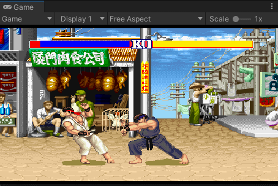
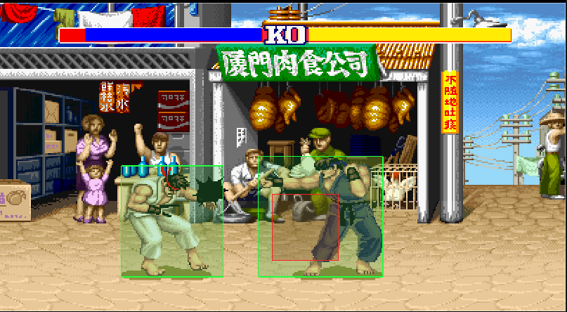

# StreetFightUnity

使用AI复刻街头霸王到 Unity 项目,（**2022.3.62f3c1**,2D 项目，无第三方依赖，只用内置模块 + UGUI）。

 

https://github.com/WarrenMondeville/StreetFightUnity.git

---

## 快速开始

1. 用 Unity Hub 打开 `StreetFighterUnity` 目录。
2. 打开场景 `Assets/Scenes/Main.unity`。
3. 点 Play。

场景里只有一个 `GameManager` 对象和一台正交摄像机，其余（角色、背景、血条、特效）都在运行时由 `GameManager` 创建。

如果场景丢失，可以用菜单 **StreetFighter → Build Scene** 重新生成（会同时刷新序列帧纹理的导入设置并写入 Build Settings）。

---

## 操作

输入基于 **Unity Input System**（键盘 + 手柄同时支持，手柄按序号分给 P1 / P2）。

| | 主机（P1，RYU1） | 副机（P2，RYU2） | 手柄 |
|---|---|---|---|
| 移动 | `W` 上 / `S` 下 / `A` 后 / `D` 前 | `↑` `↓` `←` `→` | 左摇杆 / 十字键 |
| 轻拳 / 重拳 | `J` / `K` | 小键盘 `1` / `2` | □（X）/ △（Y） |
| 轻腿 / 重腿 | `U` / `I` | 小键盘 `4` / `5` | ✕（A）/ ○（B） |

> 招式与手柄按键的对应关系写在 `Gameplay/FighterInput.cs` 的 `GamepadAttackPaths` 里。

**出招**（双方通用）：

- 波动拳：下 → 前 → 拳
- 旋风腿：下 → 后 → 腿
- 升龙拳：前 → 下 → 前 → 拳

**其他**：

- `F2` / 手柄 `Start` 暂停、继续
- `1` 人机对战（P2 由 AI 接管）
- `2` 双人对打

> 副机使用小键盘；主键盘数字 `1` `2` 专门用于切换模式，不参与攻击。

键盘按键不是写死在 C# 里的，而是由 `Resources/Config/` 下每个角色配置分片的 `keyMap.mapping`（键盘 keyCode）在运行时翻译成 Input System 的键盘路径，改配置即可改键；手柄按键则按招式固定映射。

> 需要 **Package: Input System 1.14.2**，且 `Project Settings → Player → Active Input Handling` 必须是 `Input System Package (New)`（当前工程已设为该值）。

角色靠近到一定距离会自动切换朝向，此时移动键的前后含义会镜像（与原版一致）。

---

## 从原版迁移了什么

原版核心是四件事，Unity 版本全部保持机制等价：

1. **配置驱动状态机** —— 配置按「功能 + 角色」拆成 `Assets/Resources/Config/` 下的多个 json 分片，运行时全部读出后深度合并成一棵配置树（`ConfigLoader`）。61 个角色状态、48 个 `play` 动作组合、出招表、判定框参数与原版数值一致，不手写常量。`easing` 在 C# 中按名字实现。
2. **输入缓冲连招识别** —— 移动键持续采样 + 攻击键边缘触发 + 短动作序列拼接成字符串匹配 `attack.special`（如 `forward,crouch,forward,heavy_boxing` → 升龙拳）。
3. **基于状态的攻防判定** —— 攻击等级互拼、防御削血、受击/击飞/倒地/起身短暂无敌、飞行道具相消。
4. **统一帧驱动** —— `GameClock` 以 17ms 固定步长推进所有子系统，回调按注册顺序触发；延时调用基于游戏内时钟，暂停时一并冻结。

### 资源处理

- 原版 114 张 gif 横向序列帧条带转成 png 放在 `Assets/Resources/Art/`（Unity 不支持 gif），运行时按 `framesNum` 切片成 Sprite，pivot 左上角、PPU=1。
- 13 个 mp3 放在 `Assets/Resources/Sound/`。
- `Assets/Editor/TextureSettings.cs` 统一设置导入参数：Point 过滤、不压缩、保留透明通道。

### 坐标与画面

- 沿用原版画布像素坐标（900×490，y 向下）：世界原点在画布中心，**1 世界单位 = 1 像素**。
- 摄像机 `orthographicSize = 245` + 强制 `aspect = 900/490` + `camera.rect` 居中留黑边，保证任意窗口比例下画面比例不变。
- HUD 是挂在摄像机下的 WorldSpace Canvas（900×490），与画面严格对齐，不会随分辨率漂移。
- 原版方向 `-1` 时用 canvas 变换做镜像，这里统一为「包围盒 `[left, left + width*zoom]` 不变、`scale.x = ±zoom`」，与 `changeBg` 中的左边界补偿完全吻合。

---

## 目录结构

```
Assets/
├── Resources/
│   ├── Config/                   # 按功能/角色拆分的配置分片，运行时合并
│   │   ├── global.json           # fps / key_fps / map / spiritShadow
│   │   ├── play.json             # 48 个动作的组合编排（compose）与优先级（lock）
│   │   ├── Spirit_RYU1.json      # 角色 1：states + keyMap
│   │   └── Spirit_RYU2.json      # 角色 2：states + keyMap
│   ├── Art/                      # 序列帧 png（g/ hitEffect/ magic/ RYU1/ RYU2/）
│   └── Sound/                    # mp3
├── Scenes/Main.unity
├── Editor/                       # 程序集 StreetFighter.Editor（仅 Editor 平台）
│   ├── StreetFighter.Editor.asmdef
│   ├── TextureSettings.cs        # 纹理导入设置
│   └── SceneBuilder.cs           # 生成场景
└── Scripts/StreetFighter/
    ├── StreetFighter.Runtime.asmdef
    ├── Core/                     # 引擎层（StreetFighter.Core）
    │   ├── GameClock.cs          # 17ms 固定步长逻辑帧 + 游戏内 setTimeout
    │   ├── ConfigLoader.cs       # 读取 Config/ 下所有分片并深度合并
    │   ├── GameConfig.cs         # 配置的只读视图
    │   ├── JVal.cs / JsonParser.cs
    │   ├── SpriteLibrary.cs      # 序列帧切片缓存
    │   ├── AudioPlayer.cs / SoundPaths.cs
    │   ├── Easing.cs / EasingNames.cs
    │   ├── EventBus.cs / ActionLock.cs / GameEvents.cs
    │   ├── KeyboardPaths.cs / InputActionNames.cs   # 输入：keyCode 翻译、动作名
        ├── Gameplay/                 # 玩法层（StreetFighter.Gameplay）
    │   ├── Spirit.cs             # 角色总控
    │   ├── FrameAnimator.cs / ComboAttack.cs / Mover.cs
    │   ├── FighterStatus.cs / BodyCollider.cs
    │   ├── MeleeAttack.cs / WaveProjectile.cs / AttackEffect.cs
    │   ├── FighterInput.cs / AiController.cs
    │   └── StateNames.cs / AttackState.cs / DistanceBand.cs / Side.cs / MeleeMode.cs
        ├── View/                     # 表现层（StreetFighter.View）
    │   ├── SpriteView.cs / SpiritView.cs / WaveView.cs
        └── Game/                     # 流程层（StreetFighter.Game）
            ├── GameManager.cs        # 唯一的 MonoBehaviour
            ├── GameInput.cs          # 全局输入（系统动作 + 手柄分配）
            ├── Stage.cs / StageScroll.cs / BloodBar.cs / GameMode.cs
```


## 二次开发提示

- 想调数值（伤害、判定框、帧数、位移）直接改 `Assets/Resources/Config/` 下对应的分片，不要改代码常量。
- 想加角色：在 `Assets/Resources/Config/` 下新建 `Spirit_<名字>.json`（内容形如 `{"Spirit": {"<名字>": {...states, keyMap...}}}`），无需改加载代码，再到 `GameManager.StartMatch()` 里实例化。
- 想关掉 AI：`1`/`2` 切到双人模式，或删除 `StartMatch()` 中的 `AiController` 创建。
- 想改键盘按键：改角色分片（`Spirit_*.json`）里 `keyMap.mapping` 的 keyCode（`KeyboardPaths` 负责翻译成 Input System 路径）；想改手柄按键：改 `FighterInput.GamepadAttackPaths`。
- 想加第三个玩家：给 `GameInput` 注册一个新的 `FighterInput` 即可，手柄会按注册序号自动分配。
- 出场位置、追帧上限、重开节奏等参数都提成了 `GameManager` 的 Inspector 字段，可以在场景里直接调。

### 代码风格约定

- 运行期脚本在 `StreetFighter.Runtime` 程序集，编辑器脚本在 `StreetFighter.Editor` 程序集（仅 Editor 平台）。
- 命名空间跟随目录：`StreetFighter.Core` / `StreetFighter.Gameplay` / `StreetFighter.View` / `StreetFighter.Game`。
- **一个文件一个公开类型**，文件名与类型名一致；私有嵌套类型（如 `Spirit.SpiritAction`）除外。
- 对外只暴露属性，字段一律 `private` 且以 `_` 开头；`MonoBehaviour` 上需要在 Inspector 调整的参数使用 `[SerializeField]`。
- 状态名、事件名、音效路径、Input System 动作名不用裸字符串，统一走 `StateNames` / `GameEvents` / `SoundPaths` / `EasingNames` / `InputActionNames` 常量类。
- 攻防姿态、距离分段、方位、判定体模式都用枚举（`AttackState` / `DistanceBand` / `Side` / `MeleeMode`），不比较字符串。
- 事件用 C# `event`（`FighterInput.Matched`、`BodyCollider.Hit`）；需要按字符串分发的场景用 `EventBus`（`AddListener` / `RemoveListener` / `Invoke`，语义对齐 `UnityEvent`）。
- 输入一律走 Input System：不用 `UnityEngine.Input` / `KeyCode`。每个玩家一份 `InputActionMap`（`FighterInput`），全局系统动作与设备分配在 `GameInput`。

---

图片素材来自互联网，原作者 Random，原版实现版权归 Tencent AlloyTeam。本项目仅供学习研究。
